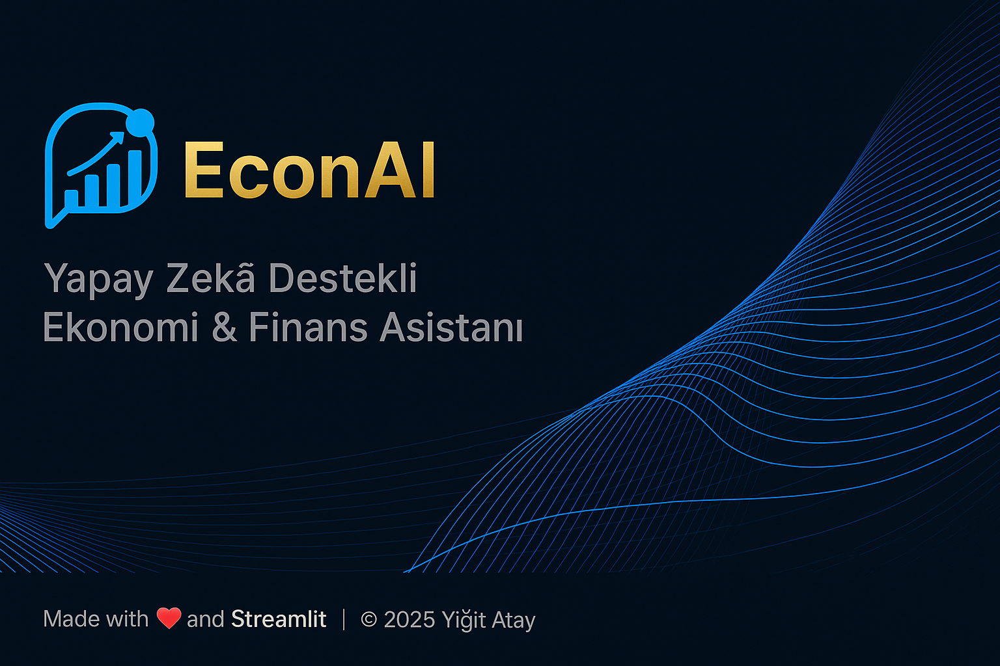
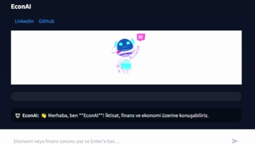
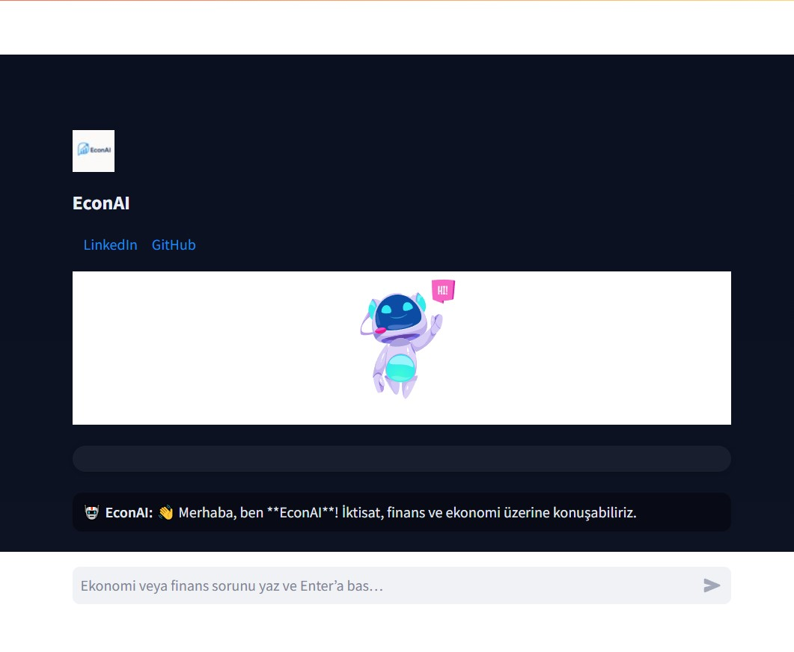
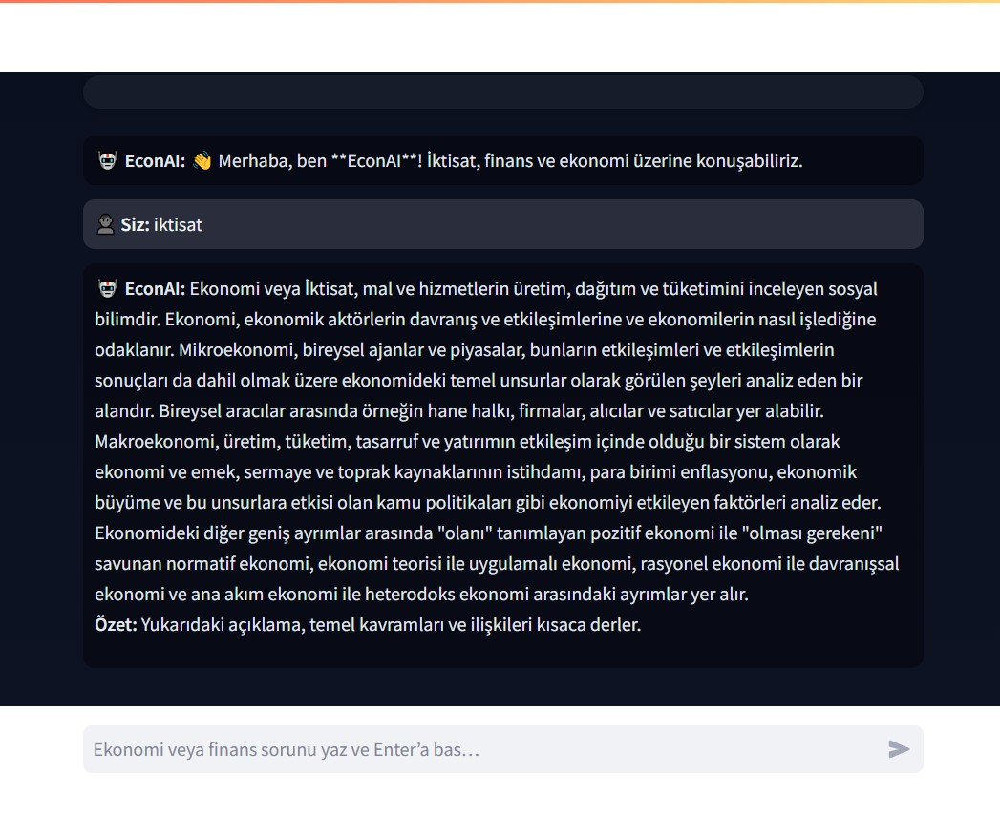

<p align="center">
  <a href="#-kurulum"></a>
  <a href="#-özellikler"></a>
  <a href="LICENSE"></a>
</p>


<!-- Open Graph Banner -->
<p align="center">
  
</p>

<h1 align="center">💹 EconAI — Akıllı Ekonomi & Finans Asistanı</h1>

<p align="center">
  
</p>

<p align="center">
  <i>“Veriyi anlamlandır, ekonomiyi keşfet, geleceği tahmin et.”</i>
</p>

<p align="center">
  <a href="https://www.python.org"></a>
  <a href="https://streamlit.io"></a>
  
  
</p>

---

## 🎥 Demo

<p align="center">
  
</p>

**EconAI**, ekonomi ve finans alanında her düzeyden kullanıcı için tasarlanmış,  
**yapay zekâ destekli bir sohbet asistanıdır.**  
Kullanıcı dostu tasarımı ve güçlü GPT tabanlı motoru ile profesyonel bir deneyim sunar.

---

## 🌍 Özellikler

✅ **Gerçek Zamanlı Chatbot**  
İktisat, finans, ekonomi politikaları ve yatırım trendleri hakkında yüksek doğrulukta yanıtlar üretir.

🧠 **GPT-4 & Wikipedia Entegrasyonu**  
OpenAI API mevcutsa GPT tabanlı yanıtlar; yoksa Wikipedia tabanlı özetleme motoru devreye girer.

🕶️ **Koyu Tema & Premium Görünüm**  
Göz yormayan renkler, okunabilir tipografi ve optimize edilmiş kontrast oranları.

🔒 **Gizlilik & Güvenlik**  
API anahtarları `.env` içinde gizli tutulur.  
`.gitignore` sayesinde bu veriler depoya dahil edilmez.

---

## 🖼️ Ekran Görüntüleri

<p align="center">
  
</p>

<p align="center">
  
</p>

---

## ⚙️ Kurulum

```bash
# Gerekli bağımlılıkları yükle
pip install -r requirements.txt

# Proje kök dizininde `.env` dosyası oluştur:

OPENAI_API_KEY=sk-xxxxxxxxxxxxxxxxxxxx
WIKI_USER_AGENT=EconAI/1.0
MODEL=gpt-4o-mini
       
        🔹 API anahtarı girilmezse sistem otomatik olarak Wikipedia moduna geçer.

---

▶️ Çalıştırma

streamlit run app.py


Tarayıcıda otomatik açılmazsa:
👉 http://localhost:8501
 adresine gidin.

---

🧩 Proje Yapısı

EconAI/
├─ app.py
├─ requirements.txt
├─ .env
├─ .gitignore
├─ README.md
├─ LICENSE
├─ assets/
│  ├─ logo.png
│  ├─ header_lottie.json
│  └─ screenshots/
│     ├─ banner.png
│     ├─ hero.png
│     ├─ chat.png
│     └─ chat_demo.gif
├─ utils/
│  ├─ __init__.py
│  ├─ ui.py
│  ├─ llm.py
│  ├─ theme_presets.py
│  ├─ database.py
│  └─ pdf_utf8.py

---

🧠 Teknolojiler

Katman	        Teknoloji
Arayüz	        Streamlit, Lottie Animations
AI              Motoru	OpenAI GPT-4, Wikipedia API
Programlama	    Python 3.10+
Görselleştirme	Plotly, Pandas, FPDF
Güvenlik	      python-dotenv, .gitignore, AGPL-3.0

---

🔐 Güvenlik

Dosya	          Amaç	                    Paylaşım
.env	          API anahtarları	          🚫 Hayır
.env.example	  Örnek yapı	              ✅ Evet
users.db	      Kullanıcı veritabanı	    🚫 Hayır
LICENSE	        Lisans metni	            ✅ Evet

---

📄 Lisans

Bu proje AGPL-3.0 lisansı ile korunmaktadır.
Kodu kişisel projelerde kullanabilir, geliştirip paylaşabilirsin.
Ticari kullanımlarda kaynak belirtilmesi zorunludur.

---

✍️ Yazar

**Yiğit Atay**  
[🌐 LinkedIn](https://www.linkedin.com/in/yi%C4%9Fit-atay-55a5b6296/) • [💻 GitHub](https://github.com/Yigit-Atay)


<p align="center">
  <i>Made with ❤️, ☕ and Streamlit</i><br>
  
</p>
